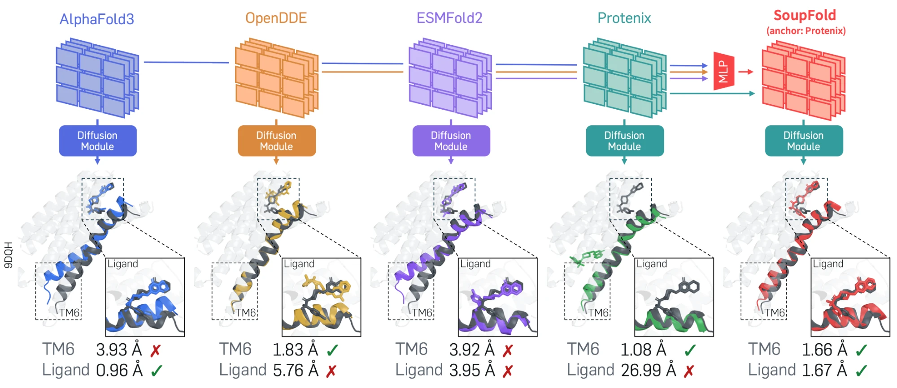
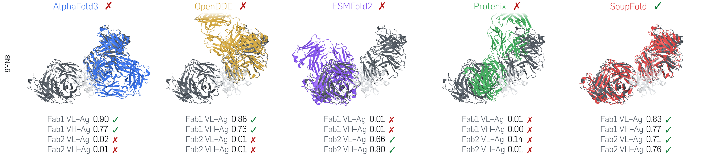

# SoupFold🍲

<p align="center"></p>

<p align="center">
  <a href="https://arxiv.org/abs/2609.15552"></a>
</p>

<p align="center">
  <a href="https://hsjang0.github.io/hsjang/">Hyosoon Jang</a>&nbsp;&nbsp;&nbsp;&nbsp;
  <a href="https://holymollyhao.github.io/">Taewon Kim</a>&nbsp;&nbsp;&nbsp;&nbsp;
  <a href="https://sungsoo-ahn.github.io/">Sungsoo Ahn</a>
</p>

## Abstract

> Co-folding models such as AlphaFold3, Protenix, ESMFold2, and OpenDDE have advanced rapidly, yet no single model consistently performs best across all biomolecular complexes. In this paper, we show that their pair representations encode complementary information that can be transferred across models to improve structure prediction. We introduce SoupFold, which combines pair representations from multiple co-folding models in a common representation space and generates structures from the combined representation. Importantly, SoupFold does not retrain the co-folding models and learns only simple mappings to transfer representations across models. We evaluate SoupFold on antibody-antigen, protein-protein, protein-ligand, molecular glue, GPCR, and oligomeric complex prediction using AlphaFold3, Protenix, ESMFold2, and OpenDDE. By combining representations across models, SoupFold improves over individual co-folding models across the considered benchmarks.

## How it works

SoupFold improves a co-folding model by combining its pair representation with those of other models.
One model serves as the **anchor**, while **peer** representations are mapped into the anchor's space and
averaged with its representation. The anchor then uses the combined representation for diffusion and
confidence prediction.

```math
H = \frac{w_{m^\star} H^{(m^\star)} + \sum_{m \in \mathcal{M} \setminus \{m^\star\}} w_m \, f_{m \to m^\star}\big(H^{(m)}\big)}{w_{m^\star} + \sum_{m \in \mathcal{M} \setminus \{m^\star\}} w_m}
```

$m^\star$ is the anchor and the other models in $\mathcal{M}$ are the peers. $H^{(m)}$ is the pair
representation of model $m$, normalised per channel, and $f_{m \to m^\star}$ is the learned map from
peer $m$ to the anchor. This code uses equal weights ($w_m = 1$). $H$ is scaled back to the anchor's
channel statistics before diffusion.
The maps and channel statistics are in `weights/`.

> **Note.** The transfer networks are not trained on RNA or DNA and may not generalize to complexes with nucleic acids.

## Example

<p align="center"></p>

`samples/best_conf/9mnb/` holds, for Protenix, OpenDDE, ESMFold2 and OpenDDE+SoupFold, the top-ranked of
25 samples (seeds 1-5), and `summary.json` gives DockQ per interface for all five, including AlphaFold3.
The AlphaFold3 structure itself is not redistributed. AlphaFold3 and OpenDDE dock only
the first Fab, ESMFold2 only the second, and Protenix neither. SoupFold docks both.

## Models

| model | code | parameters | role |
|---|---|---|---|
| AlphaFold3 | v3.0.1 | `af3.bin` (official weights) | peer |
| Protenix | 2.0.0 | `protenix_base_default_v1.0.0` | anchor, peer |
| OpenDDE | 1.1.0 | `opendde.pt` ([aurekaresearch/OpenDDE](https://huggingface.co/aurekaresearch/OpenDDE) @ `eddd563`) | anchor, peer |
| ESMFold2 | esm 3.4.0 | [biohub/ESMFold2](https://huggingface.co/biohub/ESMFold2) @ `8fc3ff4`, [biohub/ESMC-6B](https://huggingface.co/biohub/ESMC-6B) @ `45b0fa5` | anchor, peer |

Each model runs in its own Python environment.
Representations are captured and injected at runtime by `soupfold/hooks/`.

> [!CAUTION]
> SoupFold aligns the models' tokens with token maps (`soupfold/tokens.py`). We remove the two
> known differences with the patches in `patches/`. The patches are optional, and SoupFold can work without
> them through the token maps.
> Patches: `patches/protenix_parser.diff` (Protenix), `patches/opendde_parser.diff` (OpenDDE), `patches/af3_atom_layout.diff` (AlphaFold3).

## Input

One Protenix-format JSON per system, shared by all four models. MSA and template paths may be
relative to the JSON file. `examples/9mnb/` is a ready-to-run antibody example from ARK-AB
(two Fabs bound to one antigen) with its MSAs, templates and template structures.

```json
[{"name": "9mnb", "sequences": [
  {"proteinChain": {"sequence": "EVQL...", "count": 1, "unpairedMsaPath": "msa/chain1_unpaired.a3m",
                    "pairedMsaPath": "msa/chain1_paired.a3m", "templatesPath": "templates/chain1_hmmsearch.a3m"}},
  ...]}]
```

## Quick start

Copy `config.example.json` to `config.json` and fill in each model's Python environment,
weights and data files. Then run:

```bash
python scripts/soupfold.py --config config.json --input examples/9mnb/9mnb.json \
    --anchor opendde --peers af3,protenix,esmfold2
```

`--anchor` sets the anchor (Protenix, OpenDDE or ESMFold2) and `--peers` the peers, and only these models
are run.

The pipeline has two steps:

1. **Standalone runs.** The anchor and its peers run on the input and store their trunk representations,
   each with its token layout (the tokens the model made of the input, in order), so the representations
   can be aligned.
2. **SoupFold.** The anchor folds the input with its peers.

You choose what the standalone runs produce:

- **Representations only** (default). Standalone runs draw one sample with 2 diffusion steps, only to
  get the representations. Those structures are not meaningful and go to `logs/`.
- **Representations and standalone structures** (`--sample`). Standalone runs also sample 5 structures
  with each model's default steps into `samples/standalone/`, for comparison with SoupFold.

SoupFold itself always draws 5 samples with the anchor's default steps. Use `--seeds 1-5` for
several seeds. We rank samples by the anchor's own confidence.

## Outputs

Everything goes under `--workdir` (default `soupfold_out/`):

| directory | content |
|---|---|
| `samples/soupfold/<anchor>/seed_<k>/` | SoupFold structures (`<system>__s<i>.cif`) and confidences (`<system>__conf.json`) |
| `samples/standalone/<model>/seed_<k>/` | standalone structures, with `--sample` |
| `logs/<model>/seed_<k>/` | standalone runs without `--sample` |
| `reprs/`, `layouts/` | representations and token layouts |
| `logs/run/` | the output of every step |

AlphaFold3 output directories, and SoupFold outputs that use AlphaFold3 as a peer, include `TERMS_OF_USE.md`
(the AlphaFold 3 Output Terms of Use).

## Running steps individually

Each step can run on its own in the model's environment:

```bash
D="--template-mmcif-dir examples/9mnb/mmcif --release-dates <release_date_cache.json> \
   --obsolete-pdbs <obsolete_to_successor.json> --kalign <kalign>"
I="--input examples/9mnb/9mnb.json --seed 1"

# 1. standalone runs (add --sample for standalone structures)
python scripts/run_af3.py      $I --model-dir <af3> --template-mmcif-dir examples/9mnb/mmcif
python scripts/run_protenix.py $I --mode standalone $D
python scripts/run_opendde.py  $I --mode standalone $D --checkpoint <opendde.pt>
python scripts/run_esmfold2.py $I --mode standalone --ckpt <esmfold2> --esmc <esmc>

# 2. SoupFold with Protenix as anchor
python scripts/run_protenix.py $I --mode soupfold $D
```

## GPU memory

Large complexes can exceed GPU memory.

- **OpenDDE.** Its default trunk chunk sizes assume very large GPUs. On an 80 GB GPU pass smaller
  ones, e.g. `--chunk-thresholds '{"512":128,"1024":64,"1536":32,"2048":16,"3072":8,"4096":4}'`.
  The result is the same up to floating point order.
- **ESMFold2.** If 5 samples do not fit in one batch, the batch is halved automatically and the
  samples are drawn over several passes.

## AMD GPU

> **Acknowledgement.** This work was generously supported by the
> [AMD University Program](https://www.amd.com/en/corporate/university-program.html) (AUP), which provided the
> AMD Instinct GPUs used for our experiments.

All four models run on AMD Instinct GPUs with ROCm 7.2. We replace only
the framework of each environment with its ROCm build. The model packages, the weights and the patches in
`patches/` stay as they are. The settings below go into the `env` field of each model in `config.json`.

| model | framework on ROCm | settings |
|---|---|---|
| AlphaFold3 | jax / jaxlib 0.10.2, `jax-rocm7-plugin` and `jax-rocm7-pjrt` 0.10.2, tokamax 0.0.8 with `patches/tokamax_rocm.diff` | `TOKAMAX_ROCM_ATTENTION_TRITON=1`, `XLA_PYTHON_CLIENT_PREALLOCATE=false`, `XLA_PYTHON_CLIENT_ALLOCATOR=platform` |
| Protenix | torch 2.7.1+rocm7.2 | `LAYERNORM_TYPE=torch`, `PYTORCH_HIP_ALLOC_CONF=max_split_size_mb:512` |
| OpenDDE | torch 2.7.1+rocm7.2, triton 3.3.1+rocm | `LAYERNORM_TYPE=torch`, `PYTORCH_HIP_ALLOC_CONF=max_split_size_mb:512` |
| ESMFold2 | torch 2.10.0+rocm7.2, triton 3.6.0+rocm | `PYTORCH_HIP_ALLOC_CONF=max_split_size_mb:512` |

For AlphaFold3, apply `patches/tokamax_rocm.diff` inside `site-packages` with `patch -p1`.

## License

The license of SoupFold fully follows the licenses of its anchor and peer models, listed below. Artifacts
unique to SoupFold (code, transfer networks and example outputs) are also subject to these licenses.
SoupFold with AlphaFold3 as a peer cannot run without the AlphaFold3 model parameters, so its use is fully
bound by the AlphaFold3 terms.

| model | code | parameters |
|---|---|---|
| AlphaFold3 | [CC BY-NC-SA 4.0](https://github.com/google-deepmind/alphafold3/blob/main/LICENSE) | [AlphaFold 3 Model Parameters Terms of Use](https://github.com/google-deepmind/alphafold3/blob/main/WEIGHTS_TERMS_OF_USE.md) |
| Protenix | [Apache-2.0](https://github.com/bytedance/Protenix/blob/main/LICENSE) | [Apache-2.0](https://github.com/bytedance/Protenix/blob/main/LICENSE) |
| OpenDDE | [Apache-2.0](https://github.com/aurekaresearch/OpenDDE/blob/main/LICENSE) | [Apache-2.0](https://huggingface.co/aurekaresearch/OpenDDE) |
| ESMFold2 | [MIT](https://github.com/Biohub/esm) | [MIT](https://huggingface.co/biohub/ESMFold2) (ESMFold2), [MIT](https://huggingface.co/biohub/ESMC-6B) and the [Biohub Acceptable Use Policy](https://biohub.org/acceptable-use-policy/) (ESMC-6B) |

AlphaFold3 is used for non-commercial research only, as a peer and never as an anchor. This work does not
train a model similar to AlphaFold3. It trains only representation transfer networks, and none of them predicts
AlphaFold3 representations. We follow the
[AlphaFold 3 Output Terms of Use](https://github.com/google-deepmind/alphafold3/blob/main/OUTPUT_TERMS_OF_USE.md)
and [CC BY-NC-SA 4.0](https://github.com/google-deepmind/alphafold3/blob/main/LICENSE).

**Peer selection.** Without AlphaFold3, SoupFold still improves over the anchor alone. The table gives FoldBench success
rates (%, DockQ above each threshold, per interface) with ESMFold2 as the anchor and different peers:
mean ± standard deviation over 25 samples, and the top-ranked of the 25 samples in parentheses.

| peers | Ab-Ag ≥0.23 | Ab-Ag ≥0.49 | Ab-Ag ≥0.80 | P-P ≥0.23 | P-P ≥0.49 | P-P ≥0.80 |
|---|---|---|---|---|---|---|
| none (ESMFold2 alone) | 46.7±3.2 (52.4) | 37.6±2.8 (43.5) | 18.7±1.6 (24.1) | 73.14±1.16 (75.91) | 67.68±1.12 (72.63) | 38.73±1.75 (44.53) |
| OpenDDE | 58.9±2.7 (68.8) | 48.1±2.3 (56.5) | 20.8±1.8 (25.3) | 74.25±1.03 (76.28) | 69.42±1.07 (71.17) | 44.16±1.50 (45.99) |
| Protenix | 50.4±3.0 (57.6) | 41.5±2.2 (45.9) | 20.2±1.6 (24.7) | 74.80±1.06 (77.37) | 69.64±1.16 (71.90) | 42.92±1.50 (46.35) |
| Protenix + OpenDDE | 55.5±3.0 (66.5) | 45.2±2.6 (52.4) | 20.2±1.8 (22.4) | 74.67±1.06 (76.64) | 69.59±1.17 (71.53) | 44.32±1.58 (48.18) |
| Protenix + OpenDDE + AlphaFold3 (SoupFold) | 53.0±2.5 (62.9) | 43.6±1.7 (51.2) | 20.2±1.7 (24.1) | 75.33±0.94 (78.10) | 70.22±0.95 (72.63) | 45.07±1.79 (48.54) |

AlphaFold3 matters most for protein-protein interfaces, yet SoupFold improves without it too. These are
interface-level FoldBench results. For higher-order complexes, more peers helped.

## Citation

```bibtex
@article{jang2026soupfold,
  title   = {Co-folding with a Soup of Representations},
  author  = {Jang, Hyosoon and Kim, Taewon and Ahn, Sungsoo},
  journal = {arXiv preprint arXiv:2609.15552},
  year    = {2026}
}
```

Please also cite the co-folding models SoupFold builds on.

```bibtex
@article{Abramson2024,
  author  = {Abramson, Josh and Adler, Jonas and Dunger, Jack and Evans, Richard and Green, Tim and Pritzel, Alexander and Ronneberger, Olaf and Willmore, Lindsay and Ballard, Andrew J. and Bambrick, Joshua and Bodenstein, Sebastian W. and Evans, David A. and Hung, Chia-Chun and O’Neill, Michael and Reiman, David and Tunyasuvunakool, Kathryn and Wu, Zachary and Žemgulytė, Akvilė and Arvaniti, Eirini and Beattie, Charles and Bertolli, Ottavia and Bridgland, Alex and Cherepanov, Alexey and Congreve, Miles and Cowen-Rivers, Alexander I. and Cowie, Andrew and Figurnov, Michael and Fuchs, Fabian B. and Gladman, Hannah and Jain, Rishub and Khan, Yousuf A. and Low, Caroline M. R. and Perlin, Kuba and Potapenko, Anna and Savy, Pascal and Singh, Sukhdeep and Stecula, Adrian and Thillaisundaram, Ashok and Tong, Catherine and Yakneen, Sergei and Zhong, Ellen D. and Zielinski, Michal and Žídek, Augustin and Bapst, Victor and Kohli, Pushmeet and Jaderberg, Max and Hassabis, Demis and Jumper, John M.},
  journal = {Nature},
  title   = {Accurate structure prediction of biomolecular interactions with AlphaFold 3},
  year    = {2024},
  volume  = {630},
  number  = {8016},
  pages   = {493–-500},
  doi     = {10.1038/s41586-024-07487-w}
}

@article{Zhang2026.02.05.703733,
  author = {Zhang, Yuxuan and Gong, Chengyue and Zhang, Hanyu and Ma, Wenzhi and Liu, Zhenyu and Chen, Xinshi and Guan, Jiaqi and Wang, Lan and Yang, Yanping and Xia, Yu and Xiao, Wenzhi},
  title = {Protenix-v1: Toward High-Accuracy Open-Source Biomolecular Structure Prediction},
  elocation-id = {2026.02.05.703733},
  year = {2026},
  doi = {10.64898/2026.02.05.703733},
  publisher = {Cold Spring Harbor Laboratory},
  URL = {https://www.biorxiv.org/content/early/2026/02/22/2026.02.05.703733.1},
  eprint = {https://www.biorxiv.org/content/early/2026/02/22/2026.02.05.703733.1.full.pdf},
  journal = {bioRxiv}
}

@misc{project2026foldingreasoningscalingopensource,
      title={Folding, Reasoning, and Scaling with Open-source Drug Discovery Engine}, 
      author={Aureka AI OpenDDE project},
      year={2026},
      eprint={2607.03787},
      archivePrefix={arXiv},
      primaryClass={cs.AI},
      url={https://arxiv.org/abs/2607.03787}, 
}

@misc{candido2026language,
  title  = {Language Modeling Materializes a World Model of Protein Biology},
  author = {Candido, Salvatore and Hayes, Thomas and Derry, Alexander and Rao, Roshan and Lin, Zeming and Verkuil, Robert and Wu, Bryan and Lee, Jin Sub and Bruguera, Elise S. and Keval, Jehan A. and Kopylov, Mykhailo and Pak, John E. and Wu, Wesley and Thomas, Neil and Mataraso, Samson and Hsu, Alvin and Trotman-Grant, Ashton C. and Fatras, Kilian and dos Santos Costa, Allan and Badkundri, Rohil and Ak{\i}n, Halil and Oktay, Deniz and Deaton, Jonathan and Montabana, Elizabeth and Sitwala, Hrishita and Yu, Yue and Wiggert, Marius and Carlin, Dylan Alexander and Goering, Anthony W. and Blazejewski, Tomasz and Sandora, McCullen and Hla, Michael and Jia, Tina Z. and Kloker, Leon H. and Sofroniew, Nicholas J. and Uehara, Masatoshi and Pannu, Jassi and Bachas, Sharrol and Liu, Daniel S. and Sercu, Tom and Rives, Alexander},
  year   = {2026},
  url    = {https://www.biorxiv.org/content/10.64898/2026.06.03.729735},
  note   = {Preprint}
}
```
